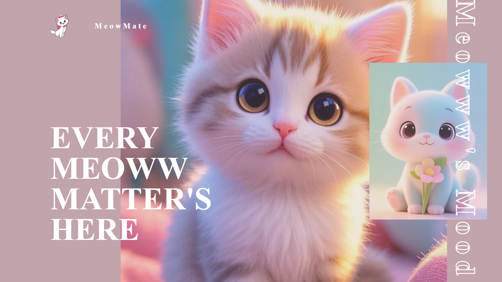

# 🐱 MeowMate — Every Meoww Matters Here 💕

> “Because every meow tells a story — of love, warmth, and whiskers.”

---

## ✨ Overview

**MeowMate** is a **cute, cozy, and heart-warming cat-themed website** designed to celebrate our feline friends.  
It brings together soft pastel tones, adorable cat illustrations, and elegant typography — making it purrfect for cat lovers, blogs, or dashboards that track your kitty’s mood and daily life.

---

## 🌸 Features

- 🐾 **Beautiful, Responsive UI** — Elegant layout that looks perfect on all devices.  
- 💖 **Pastel & Whimsical Theme** — Soothing color palette for a gentle, loving vibe.  
- 🐱 **Adorable Cat Illustrations** — Designed to melt hearts instantly!  
- 🌤️ **Dashboard Ready** — Ideal for cat trackers, mood logs, or feline blogs.  
- 🌈 **Smooth Typography** — Minimal, modern, and calming fonts.  
- 💬 **Customizable** — Easily modify texts, colors, and cat sections.

---

## 🖼️ Preview

> **Tagline:**  
> 🩷 *“Every Meoww Matter’s Here”*  
> 💭 *“Meoww’s Mood”*

---

## 🧩 Tech Stack

- **HTML5** — for clean and semantic structure  
- **CSS3 / Flexbox / Grid** — for responsive styling  

---

## 💡 Inspiration

Cats are not just pets — they’re tiny balls of joy who rule our hearts.  
This project is inspired by their warmth, curiosity, and cuteness that never fails to make us smile 😻.

---
